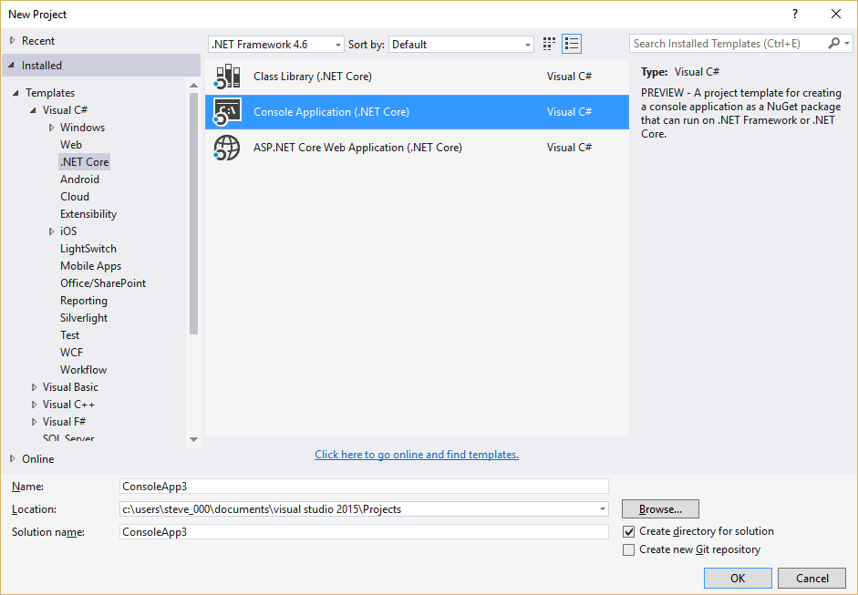
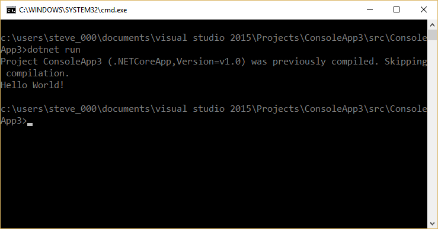
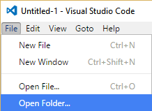
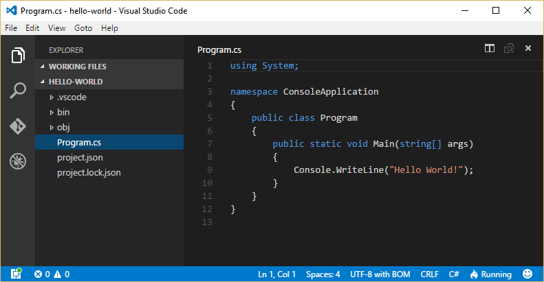

# Writing Your First C# Program
by [Steve Smith](http://deviq.com/me/steve-smith)

#### Sample Files
Download a ZIP containing this tutorial's sample files:
- [Initial Version] - Use this as a starting point when following along with the tutorial yourself
- [Completed Version] - Includes the completed versions of all samples

## Getting and Installing .NET

If you haven't already installed .NET, you'll need to do so. .NET runs on Windows, Linux, and Mac and can be used to build apps on mobile platforms including iOS and Android. To get started, navigate to http://dot.net and download the appropriate .NET Core SDK Installer for your system.

You can also [download the tools](https://www.microsoft.com/net/download#tools) needed to get started, including free tools like Visual Studio Community, Visual Studio Code, and Xamarin Studio.

## Creating an Application Using the Command Line Interface (CLI)

Open a console or terminal window and verify that you have access to the .NET Command Line Interface (CLI) by typing

> dotnet

You should see something like the following:

> Usage: dotnet [--help | app.dll]

If instead you see a message like:

> 'dotnet' is not recognized as an internal or external command, operable program, or batch file.

Then you should verify that you have installed the .NET Core SDK on your system, and confirm that the ``dotnet`` application is in your PATH.

Assuming you were successful, navigate to a new folder where you could like to work, such as ``dev``, and create a new directory, ``hello-world``. Change to that directory. Now run:

> dotnet new

You should see output like the following:

> Created new C# project in {your folder}.

If you view the files in your current folder, you should see:
- Program.cs
- project.json

*Program.cs* is a C# file (the .cs extension stands for C Sharp). It is the *entry point* of this application. All of your .NET applications will specify an entry point, unless they are hosted inside of another application (for example, legacy ASP.NET applications ran inside of IIS, and so did not expose their own *Program.cs* file or entry point). You can easily view the contents of the file by typing ``more Program.cs``, which should yield the following:

```c#
using System;

namespace ConsoleApplication
{
  public class Program
  {
    public static void Main(string[] args)
    {
      Console.WriteLine("Hello World!");
    }
  }
}
```

It's tradition in programming to have your first program in a new language or platform display "Hello World!". You can run your new C# application by typing ``dotnet restore``, which will bring in any dependencies it has via [NuGet](http://nuget.org), and then type ``dotnet run``:

    dotnet restore
    (packages are restored)
    dotnet run
    (builds the app)
    Hello World!

You can also build your application using ``dotnet build``. Calling ``dotnet run`` will automatically build the application if necessary (or if all files are up to date, it will just run the application).

## Creating an Application Using Visual Studio

To create your first C# application in Visual Studio, start by creating a new project. You can do this from the Start screen, or use the menu and select File -> New -> Project.


The *New Project* dialog appears. In the left menu, select Templates, Visual C#, .NET Core. Then choose to create a Console Application (.NET Core):


Once the project loads, the editor will open *Program.cs*, which contains an empty program. Inside the { } braces,


add a line that reads ``Console.WriteLine("Hello World!");``

Remember that C# is a case-sensitive language, so make sure you capitalize the 'C' in Console and the 'W' and 'L' in 'WriteLine'. Now you can build the project by selecting Build -> Build Solution from the main menu or using the Ctrl+Shift+B shortcut. To run the program, use the Ctrl+F5 shortcut (or Debug -> Start Without Debugging) to start the program without debugging. You should see a new console dialog appear, with the following text:


If you just see a window flash and disappear, you may be Debugging the application, which exits immediately after it displays the text. Make sure you're choosing Start Without Debugging from the menu. You can add code to make the program wait before exiting, but you'll learn about that later. You can also run your new program from the command line. Open a new command prompt (right-click on your project in Solution Explorer and choose Open Command Line -> Developer Command Prompt).


From the window that appears, type
> dotnet run

You should see the following output:



## Creating an Application Using Visual Studio Code

To get started using Visual Studio Code, the simple approach is to create the new application using the command prompt. Follow the instructions above in the *Creating an Application Using the Command Line Interface (CLI)* section. Then, open Visual Studio Code and in the menu select File -> Open Folder.



Click on *Program.cs* in the EXPLORER tab to edit it:



You can configure tasks to debug or run your program in Visual Studio Code, but that's beyond this lesson. For now, to run the application after you make changes (and save them) in Visual Studio Code, simply use ``dotnet run`` from the command line.

## Next Steps

Using the editor of your choice, create a new Console Application and confirm you're able to run it. Congratulations! You just wrote your own program! You'll learn how to make it start doing something interesting in [the next lesson](lesson-02.md).
